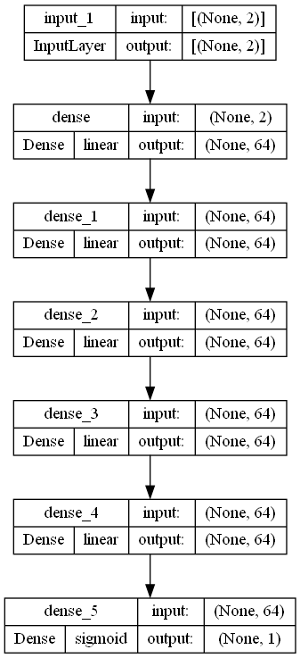
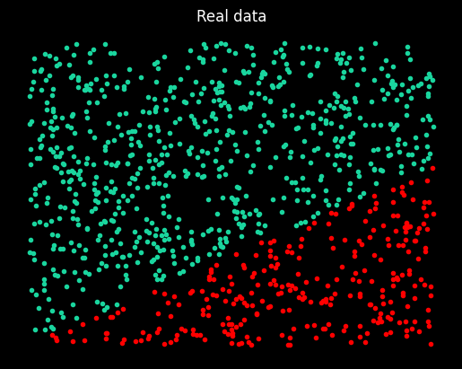
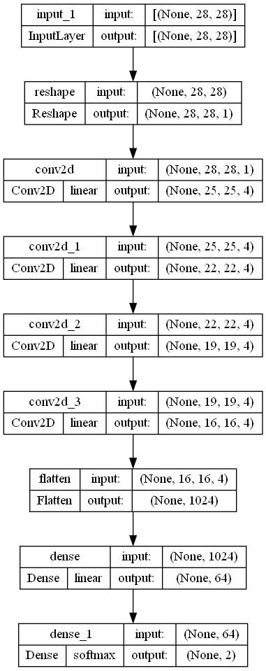
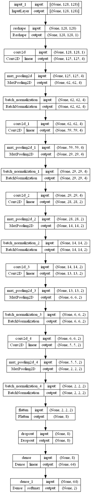

## Raske - Linguagem de Programação

### Descrição

O Raske é uma linguagem de programação desenvolvida especificamente para simplificar a criação e definição de arquiteturas de redes neurais de forma intuitiva e eficiente. Com o Raske, os desenvolvedores podem descrever a estrutura de suas redes neurais de maneira concisa e legível, sem a necessidade de lidar diretamente com a complexidade do código de implementação.

### Características

- **Sintaxe Simples**: A sintaxe da linguagem é intuitiva e fácil de aprender, permitindo que os desenvolvedores criem arquiteturas de redes neurais de forma rápida e eficaz.
- **Flexibilidade**: O Raske oferece flexibilidade para adicionar uma variedade de camadas, como camadas densas, de convolução, de dropout e outras, com diferentes configurações de parâmetros.
- **Suporte para Loops e Estruturas Condicionais**: A linguagem permite o uso de loops while e estruturas condicionais if, possibilitando a criação de arquiteturas de redes neurais dinâmicas e complexas.

## EBNF

```ebnf
NEURAL_NETWORK   = "neural_network", '{', BLOCK, '}' ;
BLOCK = { STATEMENT } ;
STATEMENT        = { ASSIGNMENT | PRINT | WHILE | IF  | ADD_INPUT_LAYER |  ADD_DENSE_LAYER | ADD_CONV_LAYER | ADD_MAXPOOLING_LAYER | ADD_BATCH_NORMALIZATION_LAYER | ADD_DROPOUT_LAYER }, "\n" ;
ASSIGNMENT       = IDENTIFIER, '=', EXPRESSION ;
PRINT            = "print", '(', EXPRESSION, ')' ;
WHILE            = "while", "(", REL_EXP, ")", "{", "\n", { (STATEMENT)}, "}" ;
IF = "if", "(", REL_EXP, ")", "{", { STATEMENT }, "}", [ "else", "{", { STATEMENT }, "}" ] ;

ACTIVATION = "relu" | "sigmoid" | "softmax" | "tanh" | "linear";
ADD_INPUT_LAYER = "add_input_layer", "(", NUMBER, ("λ"| NUMBER,),")";
ADD_DENSE_LAYER = "add_dense_layer", "(", NUMBER, ACTIVATION,")";
ADD_CONV_LAYER = "add_conv_layer", "(", NUMBER, NUMBER, NUMBER, ACTIVATION,")";
ADD_MAXPOOLING_LAYER = "add_maxpooling_layer", "(", NUMBER,")";
ADD_BATCH_NORMALIZATION_LAYER = "add_batch_normalization_layer", "(", ")";
ADD_DROPOUT_LAYER = "add_dropout_layer" , "(", NUMBER, ")";

REL_EXP = EXPRESSION, { ("==" | ">" | "<"), EXPRESSION } ;
EXPRESSION = TERM, { ("+" | "-"), TERM } ;
TERM = FACTOR, { ("*" | "/"), FACTOR } ;
FACTOR = NUMBER | IDENTIFIER | (("+" | "-" | "not"), FACTOR ) | "(", EXPRESSION, ")" ;
IDENTIFIER = LETTER, { LETTER | DIGIT | "_" } ;
NUMBER = DIGIT, { DIGIT } ;
LETTER = ( "a" | "..." | "z" | "A" | "..." | "Z" ) ;
DIGIT = '0' | '1' | '...' | '9';

```

### Diagrama sintático


## Uso
Para usar o compilador Raske, escreva seu código em um arquivo `.raske` seguindo a EBNF fornecida e execute o compilador como mostrado acima. O compilador irá gerar:

- Um arquivo .h5 com o modelo compilado.
- Um diagrama do modelo (imagem).
- Um resumo textual do modelo.

### Exemplo de código

```C
neural_network{
    add_input_layer(2)
    local i = 0
    while (i < 5){
        add_dense_layer(64, linear)
        i = i + 1
    }
    add_dense_layer(1, sigmoid)
}
```

### Compilação

```bash
$ python raske.py example.raske
```

### Saída

Caso você use o arquivo ``neural_network_2.raske`` (que está no repositório) como entrada, o compilador irá gerar o seguinte log (Script ou passo a passo da criação da rede):

- add_input_layer with input shape:  [2]
- add_dense_layer with 64 neurons and activation linear
- add_dense_layer with 64 neurons and activation linear
- add_dense_layer with 64 neurons and activation linear
- add_dense_layer with 64 neurons and activation linear
- add_dense_layer with 64 neurons and activation linear
- add_dense_layer with 64 neurons and activation linear
- add_dense_layer with 1 neurons and activation sigmoid

O que pode ser evidenciado pela seguinte figura:




Além dessas duas saídas, explore o ``neural_network_2.summary`` para mais informações sobre a rede neural criada. Por fim, vamos explorar o arquivo ``.h5`` gerado com os pesos da rede neural (que é o que nos importa).

### Importando pesos da rede neural

Para importar os pesos da rede, vamos precisar o arquivo ``.h5`` gerado pelo compilador. Para isso, vamos usar a biblioteca Keras para carregar o modelo e os pesos.

```python
loaded_model = keras.models.load_model('neural_network_2.h5')
```

Agora um objeto ``loaded_model`` foi criado com a rede neural que foi definida no arquivo ``neural_network_2.raske``. Nore que a arquitetura construida pelo arquivo ``neural_network_2.raske`` é de um problema de classificação. Vamos abordar um exemplo de uso para esse modelo.

### Treinando a rede que foi criada

Acompanhe o código no ``training_with_raske.ipynb`` para ver um exemplo de uso da rede neural que foi criada. Nesse exemplo, vamos treinar a rede neural com um conjunto de dados gerados aleatoriamente, que produziram o gráfico abaixo:



Para mais detalhes, acesse o arquivo ``training_with_raske.ipynb``.

#### Observações

Para ver outros outputs, utilize o compilador com os arquivos ``neural_network_1.raske``, ``neural_network_3.raske``, ``neural_network_4.raske`` e ``neural_network_5.raske``. Ele irá gerar os arquivos da mesma forma explorada nos passos anteriores. Por conveniência, você pode acompanhar os outputs: ``neural_network_1.png``, ``neural_network_3.png``, ``neural_network_4.png`` e ``neural_network_5.png``, que já contam com os diagramas gerados.

## Importância

A linguagem de programação Raske e seu compilador representam uma proposta de conveniência na área de redes neurais, oferecendo uma abordagem que destaca a acessibilidade e eficiência no desenvolvimento de modelos de aprendizado profundo. Ao simplificar o processo de definição e implementação de arquiteturas de redes neurais, Raske permite que pesquisadores e desenvolvedores concentrem-se mais na experimentação e inovação, em vez de se perderem em detalhes técnicos e repetições de código. Isso não apenas acelera o processo de prototipagem e testes, mas também torna a inteligência artificial mais acessível para uma gama mais ampla de usuários, incluindo aqueles com menos experiência técnica em programação direta de modelos de aprendizado de máquina. Em suma, Raske democratiza a tecnologia de redes neurais, facilitando a exploração de suas capacidades por uma variedade maior de interessados, promovendo assim uma maior inovação e aplicabilidade em diversos campos.


### Outros exemplos:

#### Código

```C
neural_network{
    add_input_layer(28, 28)
    local i = 0
    while (i < 4) {
        add_conv_layer(4, 4, 1, linear)
        i = i + 1
    }
    add_flatten_layer()
    add_dense_layer(64, linear)
    add_dense_layer(2, softmax)
}
```

#### Output (png)




#### Código

```C
neural_network{
    add_input_layer(128, 128)
    local i = 0
    while (i < 5){
        if (i < 2){
            add_conv_layer(4, 4, 1, linear)
        } else {
            add_conv_layer(2, 2, 1, linear)
        }
        add_maxpooling_layer(2)
        add_batch_normalization_layer()
        i = i + 1
    }
    add_flatten_layer()
    add_dropout_layer(50)
    add_dense_layer(64, linear)
    add_dense_layer(2, softmax)
}
```

#### Output (png)

