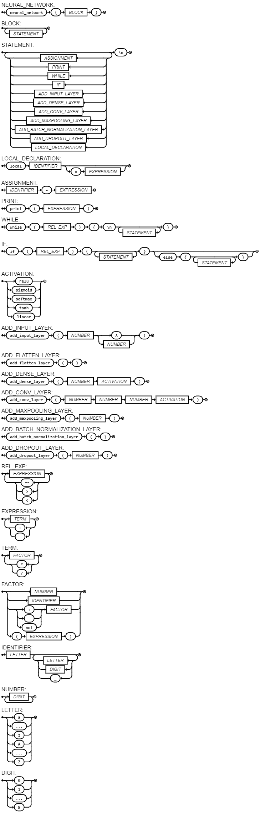

## Raske - Linguagem de Programação

### Descrição

O Raske é uma linguagem de programação desenvolvida especificamente para simplificar a criação e definição de arquiteturas de redes neurais de forma intuitiva e eficiente. Com o Raske, os desenvolvedores podem descrever a estrutura de suas redes neurais de maneira concisa e legível, sem a necessidade de lidar diretamente com a complexidade do código de implementação.

### Características

- **Sintaxe Simples**: A sintaxe da linguagem é intuitiva e fácil de aprender, permitindo que os desenvolvedores criem arquiteturas de redes neurais de forma rápida e eficaz.
- **Flexibilidade**: O Raske oferece flexibilidade para adicionar uma variedade de camadas, como camadas densas, de convolução, de dropout e outras, com diferentes configurações de parâmetros.
- **Suporte para Loops e Estruturas Condicionais**: A linguagem permite o uso de loops while e estruturas condicionais if, possibilitando a criação de arquiteturas de redes neurais dinâmicas e complexas.

## EBNF

```ebnf
NEURAL_NETWORK   = "neural_network", '{', BLOCK, '}' ;
BLOCK = { STATEMENT } ;
STATEMENT        = { ASSIGNMENT | PRINT | WHILE | IF  | ADD_INPUT_LAYER |  ADD_DENSE_LAYER | ADD_CONV_LAYER | ADD_MAXPOOLING_LAYER | ADD_BATCH_NORMALIZATION_LAYER | ADD_DROPOUT_LAYER }, "\n" ;
ASSIGNMENT       = IDENTIFIER, '=', EXPRESSION ;
PRINT            = "print", '(', EXPRESSION, ')' ;
WHILE            = "while", "(", REL_EXP, ")", "{", "\n", { (STATEMENT)}, "}" ;
IF = "if", "(", REL_EXP, ")", "{", { STATEMENT }, "}", [ "else", "{", { STATEMENT }, "}" ] ;

ACTIVATION = "relu" | "sigmoid" | "softmax" | "tanh" | "linear";
ADD_INPUT_LAYER = "add_input_layer", "(", NUMBER, ("λ"| NUMBER,),")";
ADD_DENSE_LAYER = "add_dense_layer", "(", NUMBER, ACTIVATION,")";
ADD_CONV_LAYER = "add_conv_layer", "(", NUMBER, NUMBER, NUMBER, ACTIVATION,")";
ADD_MAXPOOLING_LAYER = "add_maxpooling_layer", "(", NUMBER,")";
ADD_BATCH_NORMALIZATION_LAYER = "add_batch_normalization_layer", "(", ")";
ADD_DROPOUT_LAYER = "add_dropout_layer" , "(", NUMBER, ")";

REL_EXP = EXPRESSION, { ("==" | ">" | "<"), EXPRESSION } ;
EXPRESSION = TERM, { ("+" | "-"), TERM } ;
TERM = FACTOR, { ("*" | "/"), FACTOR } ;
FACTOR = NUMBER | IDENTIFIER | (("+" | "-" | "not"), FACTOR ) | "(", EXPRESSION, ")" ;
IDENTIFIER = LETTER, { LETTER | DIGIT | "_" } ;
NUMBER = DIGIT, { DIGIT } ;
LETTER = ( "a" | "..." | "z" | "A" | "..." | "Z" ) ;
DIGIT = '0' | '1' | '...' | '9';

```

### Diagrama sintático



## Exemplo de uso

```C

neural_network {
    add_input_layer(28, 28)
    i = 0
    while(i < 2){
        add_conv_layer(32, 3, 3, relu)
        add_maxpooling_layer(2)
        add_batch_normalization_layer()
        i = i + 1
    }
    
    add_dropout_layer(0.3)

    j = 0
    while(j < 5){
        if (j > 2){
            add_dense_layer(256, relu)
        }
        else{
            add_dense_layer(128, relu)
        }
        j = j + 1
    }
    add_dense_layer(10, softmax)
}

```